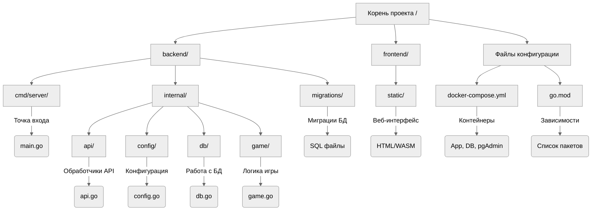

# Описание проекта
Uplink — это платформа для соревнований по скоростному набору текста в реальном времени. Проект позволяет пользователям соревноваться друг с другом, отслеживать прогресс и улучшать навыки печати через интерактивные игровые режимы.

# Функционал

*   **Соревновательный режим**: Автоматический поиск соперников равного уровня
*   **Лобби**: Создание закрытых комнат по приглашению
*   **Одиночная игра**: Режим тренировки без рейтинга
*   **Статистика**: Подсчет скорости печати и точности ввода
*   **Рейтинг**: Глобальная таблица лидеров и история матчей
*   **Безопасность**: Защита от автоматического ввода
*   **Подсчет скорости**: Измерение скорости набора
*   **Точность ввода**: Отслеживание процентного соотношения правильных символов
*   **Рейтинговая система**: Глобальная таблица лидеров
*   **История матчей**: Детальная статистика всех проведенных игр

# Технологический стек

*   **Язык программирования**: Go 1.25
*   **База данных**: PostgreSQL 18
*   **Администрирование БД**: pgAdmin 4
*   **Операционная система контейнеров**: Alpine Linux 3.23
*   **Контейнеризация**: Docker, Docker Compose

# Установка и запуск
**1. Клонируйте репозиторий**

```bash
git clone https://github.com/Timur072604/Uplink.git
cd Uplink
```

**2. Запустите проект**

Для работы проекта требуется установленный Docker.

1.  Открыть терминал в папке проекта.
2.  Запустить команду:

```bash
docker-compose up --build
```

*   **Приложение**: `http://localhost:8080`
*   **pgAdmin (База данных)**: `http://localhost:5050`

**Доступ к pgAdmin:**
*   **Email**: `admin@uplink.com`
*   **Password**: `admin`

**Подключение к серверу БД внутри pgAdmin:**
*   **Host name**: `db`
*   **Username**: `user`
*   **Password**: `pass`
*   **Database**: `uplink`

# Структура проекта


